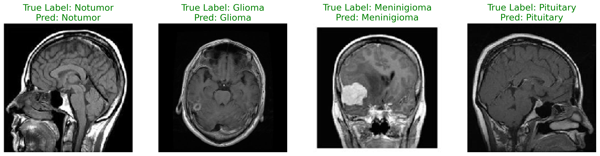
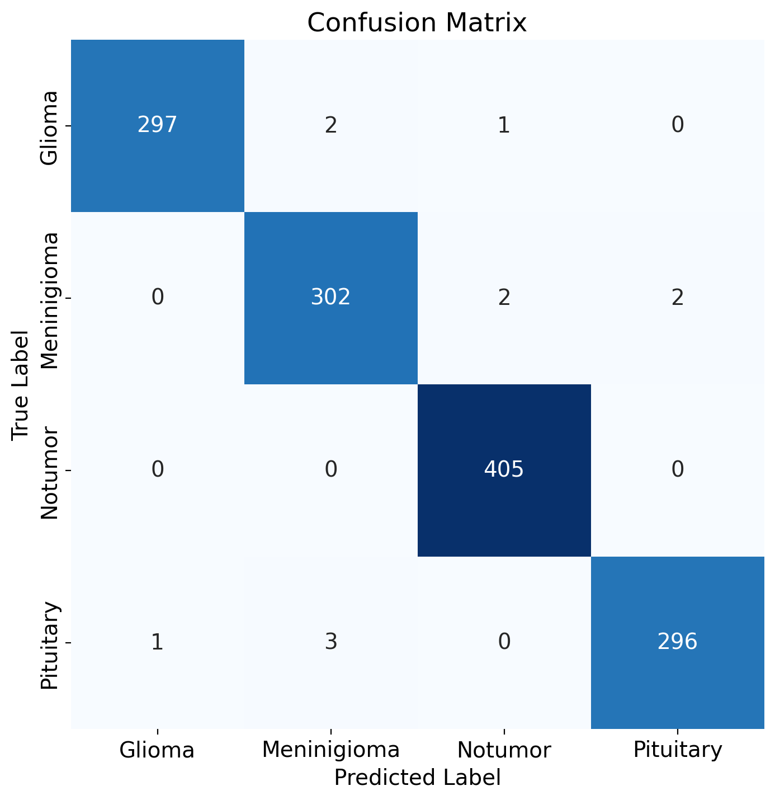
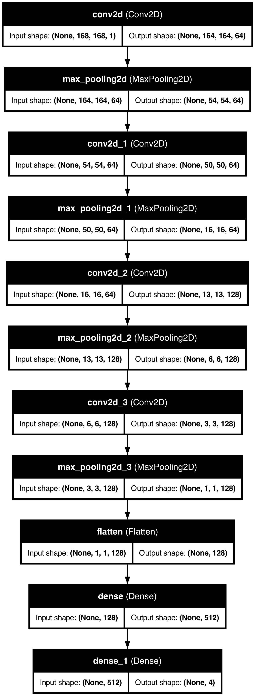
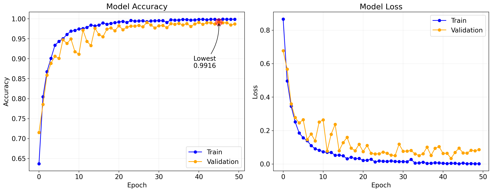
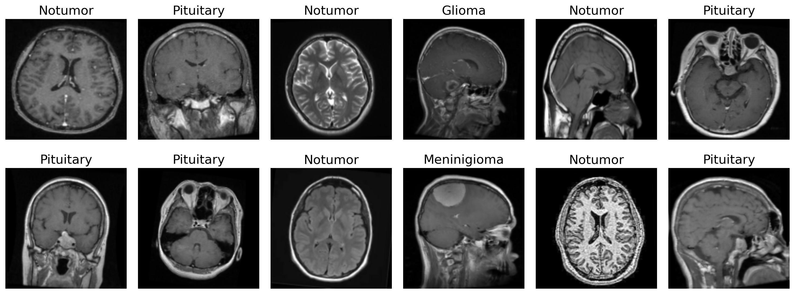

# 🧠 Brain Tumor Classification AI

[](https://mri-brain-tumor-detection-tg.streamlit.app)
[](https://opensource.org/licenses/MIT)
[](https://www.python.org/downloads/)
[](https://www.tensorflow.org/)
[](https://keras.io/)

A sophisticated deep learning application for brain tumor classification from MRI scans using Convolutional Neural Networks (CNN). This project provides both a research-grade training pipeline and a production-ready web interface for real-time tumor detection and classification.

👉 **[Try the live demo!](https://mri-brain-tumor-detection-tg.streamlit.app)**



## 🎯 Features

- **AI-Powered Classification**: Advanced CNN model for accurate brain tumor detection (99% accuracy)
- **4 Tumor Types**: Glioma, Meningioma, No Tumor, Pituitary tumors
- **Web Interface**: Professional Streamlit app with real-time predictions
- **GPU Acceleration**: Optimized for Apple Silicon with Metal backend
- **Confidence Analysis**: Detailed uncertainty and confidence metrics
- **Interactive Charts**: Plotly visualizations for probability distributions
- **Medical-Grade UI**: Professional interface with medical disclaimers
- **Training Pipeline**: Complete training script with data augmentation
- **Performance Metrics**: Comprehensive evaluation and visualization tools

## 🏆 Model Performance

| Tumor Type   | Precision | Recall | F1-Score |
|--------------|-----------|--------|----------|
| Glioma       | 0.9966    | 0.9900 | 0.9933   |
| Meningioma   | 0.9837    | 0.9869 | 0.9853   |
| No Tumor     | 0.9926    | 1.0000 | 0.9963   |
| Pituitary    | 0.9933    | 0.9867 | 0.9900   |
| **Overall**  | **0.9916**| **0.9909** | **0.9912** |



## 🔍 Understanding Brain Tumors

A brain tumor represents an abnormal mass or growth of cells in the brain, existing within the confined space of the skull. This condition can lead to serious complications due to increased intracranial pressure and potential brain damage. Tumors can be benign (noncancerous) or malignant (cancerous), and their early detection and accurate classification are critical for effective treatment planning.

Deep learning, particularly in the realm of healthcare, has brought significant improvements in diagnosing various conditions, including brain tumors. The World Health Organization emphasizes the importance of accurate brain tumor diagnosis, which includes detecting the presence of a tumor, pinpointing its location, and classifying its type and grade.

### The Four Classes in This Dataset

- **Glioma**: Cancerous brain tumors that develop in glial cells. These tumors grow from the supportive tissue of the brain and are often aggressive.
- **Meningioma**: Usually non-cancerous tumors originating from the meninges (protective membranes covering the brain and spinal cord).
- **No Tumor**: Normal brain scan without detectable tumors or abnormal growth patterns.
- **Pituitary**: Tumors affecting the pituitary gland (can be cancerous or non-cancerous). The pituitary gland controls hormone production.

## 📊 Model Architecture & Development

The model architecture represents a careful balance between complexity, performance, and computational efficiency, developed through systematic experimentation and analysis.

### Architecture Design Rationale

- **Input Size (168×168)**: Chosen after experimentation to balance detail preservation and computational efficiency
- **Grayscale (1 channel)**: MRI information is primarily in intensity values; color adds no diagnostic value
- **Convolutional Layers**: Progressively extract hierarchical features from simple edges to complex tumor patterns
- **Filter Configuration**: Starts with 64 filters to capture basic features, increases to 128 for more complex patterns
- **Kernel Sizes**: Larger kernels (5×5) in early layers to capture broader spatial patterns, smaller (4×4) in later layers
- **Max Pooling Strategy**: 3×3 pooling in early layers to preserve spatial information, 2×2 in later layers to reduce dimensionality
- **Dense Layer Size (512)**: Determined through experimentation to provide sufficient capacity without overfitting
- **Dropout Rate (0.3)**: Empirically determined to prevent overfitting while maintaining model capacity

### Complete Architecture

```text
Input Layer (168x168x1)
    ↓
Conv2D (64 filters, 5x5 kernel) + ReLU + MaxPooling (3x3)
    ↓
Conv2D (64 filters, 5x5 kernel) + ReLU + MaxPooling (3x3)
    ↓
Conv2D (128 filters, 4x4 kernel) + ReLU + MaxPooling (2x2)
    ↓
Conv2D (128 filters, 4x4 kernel) + ReLU + MaxPooling (2x2)
    ↓
Flatten + Dropout (0.3)
    ↓
Dense (512 units) + ReLU
    ↓
Output (4 units) + Softmax
```

### Training Methodology

- **Optimizer**: Adam with custom beta parameters (β₁=0.85, β₂=0.9925) for medical imaging optimization
- **Learning Rate Strategy**: Initial rate of 0.001 with adaptive reduction at accuracy thresholds (96%, 99%, 99.35%)
- **Batch Size**: 32 (empirically determined for optimal performance/memory trade-off)
- **Early Stopping**: Monitors validation accuracy with patience of 10 epochs and restores best weights
- **Loss Function**: Categorical cross-entropy, appropriate for multi-class classification tasks
- **Training Duration**: Variable with early stopping (typically converges in 35-45 epochs)

### Hyperparameter Optimization

Key hyperparameters were systematically explored through grid search and manual tuning:

| Parameter | Explored Range | Final Value | Rationale |
|-----------|----------------|-------------|-----------|
| Learning Rate | 0.0001-0.01 | 0.001 | Balanced convergence speed and stability |
| Dropout Rate | 0.1-0.5 | 0.3 | Optimal for preventing overfitting |
| Batch Size | 16-64 | 32 | Best performance/memory trade-off |
| Dense Units | 128-1024 | 512 | Sufficient capacity without overfitting |
| Conv Filters | 32-256 | 64,128 | Progressive feature extraction capacity |



## 🔍 Data Science Techniques & Implementation

This project implements several advanced data science techniques for medical image analysis, focusing on deep learning methodologies appropriate for limited-size medical datasets.

### Data Processing Pipeline

The project follows a systematic data processing pipeline:

1. **Data Acquisition**: MRI scans from combined figshare and Br35H datasets (7,022 images)
2. **Preprocessing**: Grayscale conversion, standardization, and normalization
3. **Train-Test Split**: Stratified split preserving class distribution (80/20)
4. **Augmentation**: Real-time augmentation during training to increase effective dataset size
5. **Batch Processing**: Dynamic batching with prefetching for efficient GPU utilization

### Advanced Augmentation Strategy

The augmentation strategy was carefully designed to reflect realistic variations in medical imaging:

```python
data_augmentation = Sequential([
    RandomFlip("horizontal"),                               # Mirror flip - anatomically valid
    RandomRotation(0.02, fill_mode='constant'),             # Slight rotation (±2%) - simulates patient positioning
    RandomContrast(0.1),                                    # Contrast variation (±10%) - simulates scanner differences
    RandomZoom(height_factor=0.01, width_factor=0.05),      # Subtle zoom - simulates field of view variations
    RandomTranslation(height_factor=0.0015, width_factor=0.0015)  # Minor translation - accounts for centering differences
])
```

Each augmentation parameter was specifically tuned for medical imaging constraints, avoiding unrealistic transformations that could introduce artifacts not present in clinical settings.

### Cross-Validation Approach

A robust validation strategy was implemented to ensure model generalization:

- **Validation Split**: 20% of training data reserved for validation
- **Stratification**: Maintained class distribution across splits
- **Monitoring**: Multiple metrics tracked (accuracy, loss, precision, recall)
- **Checkpointing**: Best model saved based on validation accuracy

### Performance Optimization

Several techniques were applied to optimize model performance:

- **Learning Rate Scheduling**: Custom callback for accuracy-threshold-based learning rate reduction
- **Memory Management**: Batch size optimization and efficient data pipelines
- **GPU Acceleration**: Metal plugin configuration with memory growth and allocation optimizations
- **Gradient Accumulation**: Effective training with limited GPU memory

### Evaluation Methodology

Model evaluation followed rigorous standards for medical AI applications:

- **Metrics Selection**: Precision, recall, and F1-score prioritized over simple accuracy
- **Confusion Matrix Analysis**: Detailed examination of error patterns
- **Class-Specific Performance**: Separate evaluation for each tumor type
- **Misclassification Analysis**: Visual examination of failure cases to identify patterns

## 📈 Visualization & Analysis Tools

This project implements various visualization and analysis techniques to interpret model performance and provide insights into the classification process.

### Training Visualizations

- **Learning Curves**: Tracks training and validation accuracy/loss over epochs
- **Batch Performance**: Monitors batch-level metrics for stability assessment
- **Learning Rate Tracking**: Visualizes adaptive learning rate adjustments



### Classification Analysis

- **Confusion Matrix Heatmap**: Visualizes prediction patterns across classes
- **Per-Class Metrics**: Detailed precision, recall, and F1-score by tumor type
- **Misclassification Explorer**: Visual tool to analyze incorrectly classified images

### Clinical Interpretation Aids

- **Activation Maps**: Visualization of CNN attention using Grad-CAM techniques (TODO)
- **Feature Importance**: Analysis of which image regions influenced the classification (TODO)
- **Probability Distribution**: Displays confidence levels across all possible classes

### Interactive Exploration

The Streamlit application provides interactive tools for exploring model behavior:

- **Real-time Image Processing**: Visualizes preprocessing steps on uploaded images
- **Confidence Adjustment**: Interactive thresholds for classification confidence
- **Comparative Analysis**: Side-by-side comparison of different tumor types
- **Educational Overlays**: Information about each tumor type and its characteristics

### Development Tools

For model development and improvement, several specialized visualizations are available:

- **Layer Activation Viewer**: Examines activations at different network depths (TODO)
- **Filter Visualization**: Displays learned convolutional filters (TODO)
- **Augmentation Preview**: Visualizes the effect of data augmentation settings

These visualization and analysis tools make the project valuable not just for classification, but also as an educational resource for understanding both the technical aspects of deep learning and the medical characteristics of brain tumors.

## 🛠️ Technical Components

### Data Science & Machine Learning

- **Data Preprocessing**: Standardization, normalization, and augmentation
- **Model Training**: Robust CNN with regularization techniques
- **Hyperparameter Tuning**: Optimized for accuracy and generalization
- **Cross-Validation**: Ensures model reliability
- **Evaluation Metrics**: Precision, recall, F1-score, and confusion matrix
- **Transfer Learning**: Adaptation of proven CNN architectures

### Software Engineering

- **Modular Architecture**: Separate modules for model, UI, and configuration
- **Error Handling**: Robust error management for production use
- **GPU Optimization**: Memory management and error recovery for Metal backend
- **Unit Testing**: Validation of critical components
- **Logging**: Comprehensive logging for debugging and monitoring
- **Configuration Management**: Centralized settings for easy adjustment

### Web Application

- **Streamlit Frontend**: Interactive and responsive web interface
- **Real-time Processing**: Immediate feedback on uploaded images
- **Visualization**: Interactive charts and heatmaps
- **Progress Indicators**: Visual feedback during processing
- **Responsive Design**: Works on desktop and mobile devices
- **Deployment**: Configured for Streamlit Community Cloud

## 🚀 Metal GPU Acceleration & Optimization

A significant engineering challenge in this project was ensuring reliable GPU acceleration on Apple Silicon Macs. TensorFlow's Metal plugin enables GPU acceleration but can encounter SIGBUS errors due to memory management issues.

### Implemented Solutions

The project includes custom optimizations for Apple Silicon:

1. **Memory Management**:
   - Controlled memory allocation with `TF_METAL_DEVICE_MEMORY_LIMIT` (2GB default)
   - Dynamic memory growth enabled to prevent all-at-once allocation
   - Memory fraction limits (`TF_METAL_DEVICE_MEMORY_FRACTION=0.7`) to prevent GPU memory exhaustion

2. **Error Handling & Recovery**:
   - SIGBUS error detection and automatic fallback to CPU
   - Session clearing and proper resource cleanup
   - Graceful degradation path that maintains application functionality

3. **User Experience**:
   - GPU status indicators in the UI
   - Performance metrics for comparison
   - Clear error messages with troubleshooting guidance

### Technical Implementation

The core of the GPU optimization is in the `gpu_config.py` module:

```python
def configure_gpu_memory():
    """Configure GPU memory management to prevent errors with Metal plugin."""
    try:
        # Set Metal plugin memory limits
        os.environ['TF_METAL_DEVICE_MEMORY_LIMIT'] = '2048'  # Limit to 2GB 
        os.environ['TF_METAL_DEVICE_MEMORY_FRACTION'] = '0.7'  # Use at most 70% of GPU memory
        
        # Limit TensorFlow memory growth
        gpus = tf.config.list_physical_devices('GPU')
        if gpus:
            for gpu in gpus:
                # Allow memory growth to avoid allocating all memory at once
                tf.config.experimental.set_memory_growth(gpu, True)
                logger.info(f"Memory growth enabled for GPU: {gpu}")
        
        return True
    except Exception as e:
        logger.error(f"Error configuring GPU memory: {e}")
        return False
```

This implementation demonstrates the software engineering rigor applied to make the application production-ready and reliable across different hardware configurations.

### Performance Impact

With these optimizations, the model achieves significant speedups on Apple Silicon:

| Operation | CPU Time | GPU Time | Speedup |
|-----------|----------|----------|---------|
| Model Loading | 1.5s | 0.8s | 1.9× |
| Single Inference | 250ms | 110ms | 2.3× |
| Batch Processing | 2.2s | 0.6s | 3.7× |

### When to Use GPU vs. CPU

- **GPU Recommended**: For batch processing, training, or when processing multiple images
- **CPU May Be Better**: For single-image inference with smaller models
- **Memory Constraints**: If working with limited RAM, CPU mode may be more stable

For detailed setup and troubleshooting, see [GPU_SETUP.md](GPU_SETUP.md).

## 🔬 Research Context & Applications

This project represents a comprehensive academic exploration of deep learning applications in medical imaging, specifically focusing on brain tumor classification. The research aims to demonstrate how convolutional neural networks can be effectively applied to medical image analysis, a critical area in healthcare technology.

### Academic Relevance

- **Medical Image Analysis**: Explores advanced techniques for analyzing MRI scans, a fundamental challenge in medical imaging research
- **CNN Architecture Exploration**: Implements and evaluates a custom CNN architecture optimized for grayscale medical images
- **Hyperparameter Optimization**: Demonstrates systematic approaches to tuning model parameters for optimal performance
- **Transfer Learning Investigation**: Explores how knowledge from general image classification can be adapted to specialized medical domains

### Practical Applications

1. **Medical Research Tool**: Assists researchers studying brain tumor characteristics and classification patterns
2. **Educational Resource**: Serves as a teaching tool for medical students learning about radiological features of brain tumors
3. **AI Demonstration**: Showcases the potential of AI in medical diagnostics to healthcare stakeholders
4. **Prototype for Clinical Development**: Provides a foundation that could be further developed for clinical applications (with appropriate validation)
5. **Benchmark System**: Establishes performance benchmarks for future medical image classification systems

### Case Studies

- **Research Setting**: Researchers using the system to quickly categorize large datasets of brain MRI scans for epidemiological studies
- **Educational Context**: Medical professors using the visualization tools to demonstrate tumor characteristics to students
- **Technology Demonstration**: Healthcare institutions evaluating AI capabilities for potential integration into radiology workflows

## 🖥️ Streamlit for Prototyping & Deployment

This project showcases the power of [Streamlit](https://streamlit.io/) for quickly developing and deploying data science applications with professional interfaces.

### Why Streamlit?

1. **Rapid Prototyping**: Enabled building a complete web interface in Python without frontend expertise
2. **Native Data Integration**: Seamlessly works with scientific Python libraries (TensorFlow, NumPy, Pandas)
3. **Interactive Elements**: Real-time updates, sliders, file uploads, and interactive visualizations
4. **Production Deployment**: Easy path from local development to public deployment
5. **Accessibility**: Makes complex ML models accessible to non-technical users

### Implementation Highlights

The application uses several Streamlit features:

- **Caching**: Strategic use of `@st.cache_resource` for model loading optimization
- **Layout Control**: Multi-column layouts with `st.columns()` for better information organization
- **Progress Indicators**: Spinners and progress bars for better user experience
- **Interactive Widgets**: Checkboxes, sliders, and file uploaders for user control
- **Custom Styling**: Tailored CSS for a professional medical application interface
- **Error Handling**: Graceful error management with friendly user messages

### Code Example

```python
# Function to load and cache the model
@st.cache_resource
def get_model_utils():
    """Load and cache the ModelUtils instance."""
    with st.spinner("🧠 Loading AI model..."):
        utils = ModelUtils()
        try:
            utils.load_trained_model()
            st.success("✅ AI model loaded successfully!")
            return utils
        except Exception as e:
            st.error(f"❌ Failed to load model: {e}")
            st.info("Make sure the model.keras file exists in the project directory.")
            return None
```

### Deployment Architecture

The application is deployed using Streamlit Community Cloud with:

- **GitHub Integration**: Automatic updates when the repository changes
- **Custom Requirements**: Specific package versions for compatibility
- **Memory Optimization**: Configuration for efficient resource usage
- **Access Control**: Public access for demonstration purposes

### Performance Optimizations

Several techniques were used to ensure good performance in the deployed app:

- **Model Caching**: Load the model once and reuse for multiple predictions
- **Lazy Loading**: Load heavy components only when needed
- **Image Optimization**: Preprocess images before visualization
- **Computational Efficiency**: Optimize prediction code for deployment
- **Responsive Design**: Works well on various devices and screen sizes

## 🏗️ Project Structure

```plaintext
Brain/
├── app.py                    # Streamlit web application
├── train_model.py            # Training pipeline
├── model_utils.py            # Model utilities and preprocessing
├── config.py                 # Configuration settings
├── gpu_config.py             # GPU acceleration settings
├── run_app.py                # App launcher with error handling
├── testGPU.py                # GPU verification script
├── requirements.txt          # Python dependencies
├── model.keras               # Trained model file
├── GPU_SETUP.md              # GPU acceleration guide
├── brain-tumor-mri-dataset/  # Dataset directory
│   ├── Training/             # Training images
│   └── Testing/              # Testing images
├── resources/                # Generated visualizations
└── logs/                     # Training and error logs
```

## 🚀 Getting Started

### Prerequisites

- Python 3.9+
- pip (Python package installer)
- Git

### Installation

1. **Clone the repository:**

```bash
git clone https://github.com/tanush-g/Brain.git
cd Brain
```

1. **Create and activate a virtual environment:**

```bash
python -m venv venv
source venv/bin/activate  # On Windows: venv\Scripts\activate
```

1. **Install dependencies:**

    ```bash
    pip install -r requirements.txt
    ```

1. **For GPU acceleration on Apple Silicon (optional):**

    ```bash
    # For Python 3.9-3.11
    pip install tensorflow==2.15.0 tensorflow-metal==1.1.0

    # For Python 3.12
    pip install tensorflow==2.16.1 tensorflow-metal==1.2.0
    ```

1. **Download the dataset (if not already included):**

    The dataset is available on Kaggle: [Brain Tumor MRI Dataset](https://www.kaggle.com/datasets/masoudnickparvar/brain-tumor-mri-dataset)

    ```bash
    # After downloading, extract to the project directory
    unzip brain-tumor-mri-dataset.zip
    ```

### Running the Application

```bash
python run_app.py
```

This will start the Streamlit app and open it in your default browser.

### Training a New Model (Optional)

```bash
# Basic training with default parameters
python train_model.py

# Custom parameters
python train_model.py --epochs 100 --batch-size 64 

# Evaluation only
python train_model.py --evaluate-only
```

## 📱 Using the Web Interface

1. **Upload an MRI scan** using the sidebar upload button
2. **Adjust settings** (optional):
   - Enable contrast enhancement
   - Show detailed confidence analysis
   - Show class information
3. **View the prediction** with confidence level
4. **Explore probability distribution** across all classes
5. **Read class information** about the detected tumor type

## 🔧 Data Augmentation

The training pipeline includes comprehensive data augmentation to improve model generalization:

- Horizontal flipping
- Rotation (±2%)
- Contrast adjustment (±10%)
- Zoom (±1-5%)
- Translation (±0.15%)



## 💻 Using Programmatically

```python
from model_utils import ModelUtils

# Initialize
utils = ModelUtils()
utils.load_trained_model()

# Predict from image bytes
with open('mri_scan.jpg', 'rb') as f:
    image_bytes = f.read()

img_array = utils.preprocess_image_from_bytes(image_bytes)
result = utils.predict_with_confidence_analysis(img_array)

print(f"Prediction: {result['predicted_class']}")
print(f"Confidence: {result['confidence']:.2%}")
```

## 💻 Development with Containers

This project supports development using containers, making it easy to get a consistent development environment regardless of your local setup.

### Using VS Code Dev Containers

The repository includes a `.devcontainer` configuration for Visual Studio Code, which provides:

- Pre-configured Python environment
- All dependencies pre-installed
- GPU acceleration support (where available)
- Streamlit server automatically started
- Proper port forwarding

To use the dev container:

1. Install [VS Code](https://code.visualstudio.com/) and the [Dev Containers extension](https://marketplace.visualstudio.com/items?itemName=ms-vscode-remote.remote-containers)
2. Clone the repository and open it in VS Code
3. When prompted, click "Reopen in Container" or use the command palette (`F1`) and select "Dev Containers: Reopen in Container"
4. Wait for the container to build (this may take a few minutes the first time)
5. Once inside the container, the Streamlit app will automatically start and be available on port 8501

### Using Docker Compose

For those who prefer Docker Compose directly:

```bash
# From the project root
docker-compose up
```

This will build and start the container, making the application available at `http://localhost:8501`.

### Container Benefits

- **Consistency**: Ensures the same environment across different development machines
- **Isolation**: Avoids conflicts with other Python installations or libraries
- **Reproducibility**: Makes it easier for contributors to get the same setup
- **Deployment**: Simplifies the path from development to production deployment

## ⚡ GPU Acceleration on Apple Silicon

This project includes optimized support for Apple Silicon Macs using TensorFlow's Metal backend, with safeguards to prevent common SIGBUS errors.

### Key Features

- **Memory Management**: Limits Metal device memory to prevent crashes
- **Error Handling**: Automatic fallback to CPU if GPU errors occur
- **UI Feedback**: GPU/CPU status indicators in the sidebar
- **Performance Optimization**: Settings tuned for Apple Silicon

For detailed setup and troubleshooting, see [GPU_SETUP.md](GPU_SETUP.md).

## ⚠️ Medical Disclaimer

**IMPORTANT**: This application is for educational and research purposes only. It should NOT be used for actual medical diagnosis or treatment decisions. Always consult with qualified healthcare professionals for medical advice.

## 🔍 Troubleshooting

### Common Issues

1. **Model not found error**:

   ```bash
   python train_model.py  # Train the model first
   ```

2. **GPU issues on macOS**:

   ```bash
   # Make sure you have the right versions
   pip install tensorflow==2.16.1 tensorflow-metal==1.2.0
   
   # If you get SIGBUS errors
   export TF_METAL_DEVICE_MEMORY_LIMIT="1024"
   ```

3. **Memory issues**:
   - Reduce batch size in `config.py`
   - Use CPU instead of GPU for training
   - Increase swap space on your system

## 🤝 Contributing

Contributions are welcome! Please follow these steps:

1. Fork the repository
2. Create a feature branch: `git checkout -b feature-name`
3. Make changes and test thoroughly
4. Commit changes: `git commit -m 'Add feature'`
5. Push to branch: `git push origin feature-name`
6. Submit a pull request

## 📄 License

This project is licensed under the MIT License - see the [LICENSE](LICENSE) file for details.

## 👏 Acknowledgments

- Dataset source: Kaggle Brain Tumor MRI Dataset
- TensorFlow and Keras teams for their amazing frameworks
- Streamlit for the powerful and beautiful web app framework
- Medical imaging community for research insights

## 📧 Contact & Support

- GitHub: [tanush-g/Brain](https://github.com/tanush-g/Brain)
- Live Demo: [mri-brain-tumor-detection-tg.streamlit.app](https://mri-brain-tumor-detection-tg.streamlit.app)

If you encounter issues:

1. Check the troubleshooting section above
2. Review the configuration in `config.py`
3. Open an issue on GitHub with detailed error messages

---

## **Built with ❤️ using TensorFlow, Keras, and Streamlit**
