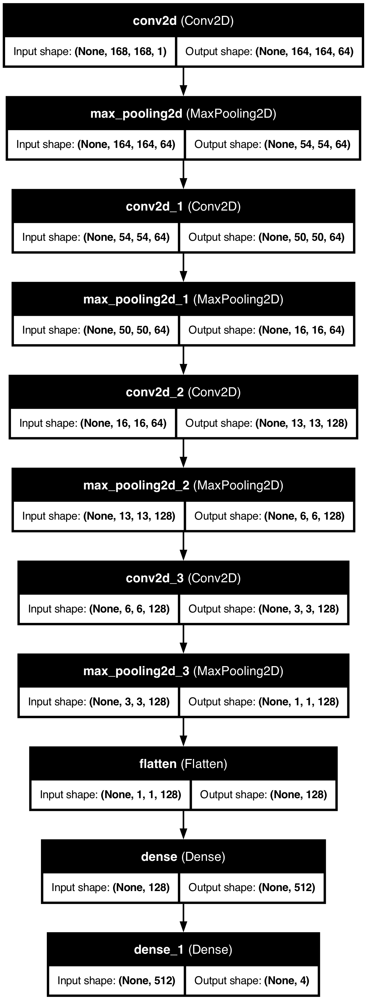

# Deep Learning based Brain Tumour Classification using CNNs and MR Imaging

## CNN Model using Tensorflow

This project aims to classify brain MRI images into four categories: Glioma, Meningioma, No tumor, and Pituitary tumor. It utilizes TensorFlow to build and train a convolutional neural network (CNN) for the task.

## Understanding Brain Tumors and Detection Methods

A brain tumor represents an abnormal mass or growth of cells in the brain, existing within the confined space of the skull. This condition can lead to serious complications due to increased intracranial pressure and potential brain damage. Tumors can be benign (noncancerous) or malignant (cancerous), and their early detection and accurate classification are critical for effective treatment planning, underscoring the importance of advancements in medical imaging.

Deep learning, particularly in the realm of healthcare, has brought significant improvements in diagnosing various conditions, including brain tumors. The World Health Organization emphasizes the importance of accurate brain tumor diagnosis, which includes detecting the presence of a tumor, pinpointing its location, and classifying its type and grade. This notebook explores the use of Convolutional Neural Networks (CNNs) in a multi-task approach for the detection, classification, and location identification of brain tumors using MRI images, showcasing the potential of these models to revolutionize diagnostics in neurology.

## About the Dataset

This dataset is a compilation of two primary datasets: figshare and Br35H. The dataset comprises a total of `7023` human **brain MRI images**, categorized into four distinct classes. The dataset focuses on brain tumors and their classification. The four classes are as follows:

- **Glioma**: Cancerous brain tumors in glial cells.
- **Meningioma**: Non-cancerous tumors originating from the meninges.
- **No Tumor**: Normal brain scans without detectable tumors.
- **Pituitary**: Tumors affecting the pituitary gland, which can be cancerous or non-cancerous.

Advancing the development of machine learning models for tumor classification is crucial for driving progress in the field of neurology and making a significant impact on the lives of individuals. These models have the potential to enhance medical research, improve diagnostic accuracy, and contribute to effective treatment strategies for various types of tumors. By leveraging machine learning techniques, we can significantly aid in the advancement of neurology and ultimately improve healthcare outcomes for people affected by tumors.

The "No Tumor" class images were obtained from the `Br35H dataset`.

The data link and complete description here [`Brain Tumor Data on Kaggle`](https://www.kaggle.com/datasets/masoudnickparvar/brain-tumor-mri-dataset)

## Introduction

This project leverages a TensorFlow-based deep learning Convolutional Neural Network (CNN) model to classify brain tumors from MRI images into four categories: Glioma, Meningioma, Pituitary, and No Tumor. The integration of artificial intelligence (AI) and machine learning (ML) in medical imaging aims to enhance diagnostic accuracy and efficiency, reducing reliance on manual interpretation by radiologists.

## Motivation

Brain tumors are a significant medical concern with severe implications for patients. Misdiagnosis can lead to delayed treatment, inappropriate interventions, and reduced survival rates. This project aims to improve diagnostic tools in neuro-oncology by using AI to address current limitations in brain tumor detection and classification.

## Scope of Work

This project encompasses the end-to-end development of a CNN-based model for brain tumor classification from MRI images. The key phases include:

1. **Data Collection**: Utilizing a dataset of 7,023 human brain MRI images categorized into four classes: Glioma, Meningioma, No Tumor, and Pituitary.
2. **Data Preprocessing**: Standardizing image dimensions, normalizing pixel values, encoding labels, splitting the dataset, and applying data augmentation techniques.
3. **Model Design**: Developing a sequential CNN model with four convolutional layers, max pooling layers, flattening layers, and dense layers for classification.
4. **Model Training**: Using the Adam optimizer, categorical cross-entropy loss function, and implementing training callbacks such as ReduceLROnPlateau and ModelCheckpoint.
5. **Model Evaluation**: Splitting the dataset into training and testing sets, evaluating model performance using accuracy, precision, recall, F1-score, and confusion matrix.
6. **Deployment**: Creating a user-friendly interface for uploading MRI images and receiving classification results.
7. **Documentation**: Documenting the development process, including data processing, model building, and evaluation.

## Methodology

### Data Collection

The dataset consists of 7,023 MRI images categorized as Glioma, Meningioma, No Tumor, and Pituitary. The images are sourced from figshare and Br35H Datasets.

### Data Preprocessing

- **Image Resizing**: All images are resized to 168x168 pixels.
- **Normalization**: Pixel values are normalized to the range [0, 1].
- **Label Encoding**: Labels are encoded into one-hot vectors.
- **Train/Test Splitting**: The dataset is split into training and testing sets.
- **Data Augmentation**: Techniques include random horizontal flipping, rotation, contrast adjustment, zoom, and slight translations.

### Model Design

The CNN model architecture includes:

- Four convolutional layers with increasing filter sizes (64 to 128).
- Max pooling layers for spatial dimension reduction.
- A flattening layer to convert 2D feature maps to a 1D vector.
- Two dense layers with SoftMax activation for multi-class classification.

### Model Training

- **Optimizer**: Adam optimizer with a learning rate of 0.001.
- **Loss Function**: Categorical cross-entropy.
- **Training Callbacks**: ReduceLROnPlateau and ModelCheckpoint.
- **Hyperparameter Tuning**: Batch size of 32 and 50 epochs. Early stopping and learning rate scheduling are used to prevent overfitting.

### Model Evaluation

**Class-wise metrics:**

**Class: Glioma**
Precision: 0.9966
Recall: 0.9900
F1-Score: 0.9933

**Class: Meninigioma**
Precision: 0.9837
Recall: 0.9869
F1-Score: 0.9853

**Class: Notumor**
Precision: 0.9926
Recall: 1.0000
F1-Score: 0.9963

**Class: Pituitary**
Precision: 0.9933
Recall: 0.9867
F1-Score: 0.9900

Overall Accuracy: 0.9916

**Confusion Matrix**: Visualizing model performance across all classes.

### Deployment

The trained model is saved in Keras format and integrated into a user-friendly interface for clinical use.

## Results and Discussion

The results indicate that the CNN model performs well in classifying brain tumors from MRI images, achieving high accuracy (99+%) and reliability. The implementation demonstrates the potential of deep learning in enhancing diagnostic accuracy and efficiency in neuro-oncology.

## Conclusion and Future Work

This project showcases the application of CNNs in medical imaging, providing a valuable tool for brain tumor classification. Future work may involve further refining the model, expanding the dataset, and integrating the system into clinical workflows to assist healthcare professionals.

## Project Structure

The project is organized as follows:

- `brain-tumor-classification.ipynb`: Jupyter notebook containing the main analysis and model training.
- `cleanedscript.py`: Python script derived from the Jupyter notebook for streamlined execution.
- `brain-tumor-mri-dataset/`: Directory containing the MRI dataset split into Training and Testing sets.
- `Data/`: Directory containing additional data for the project.
- `model.keras`: Trained model saved in Keras format.
- `README.md`: This file, providing an overview and instructions for the project.

## Setup

To run this project, you will need Python 3.8 or later and the following packages:

- TensorFlow 2.16 or later
- Matplotlib
- NumPy

You can install the necessary packages using pip:

`pip install tensorflow matplotlib numpy`
